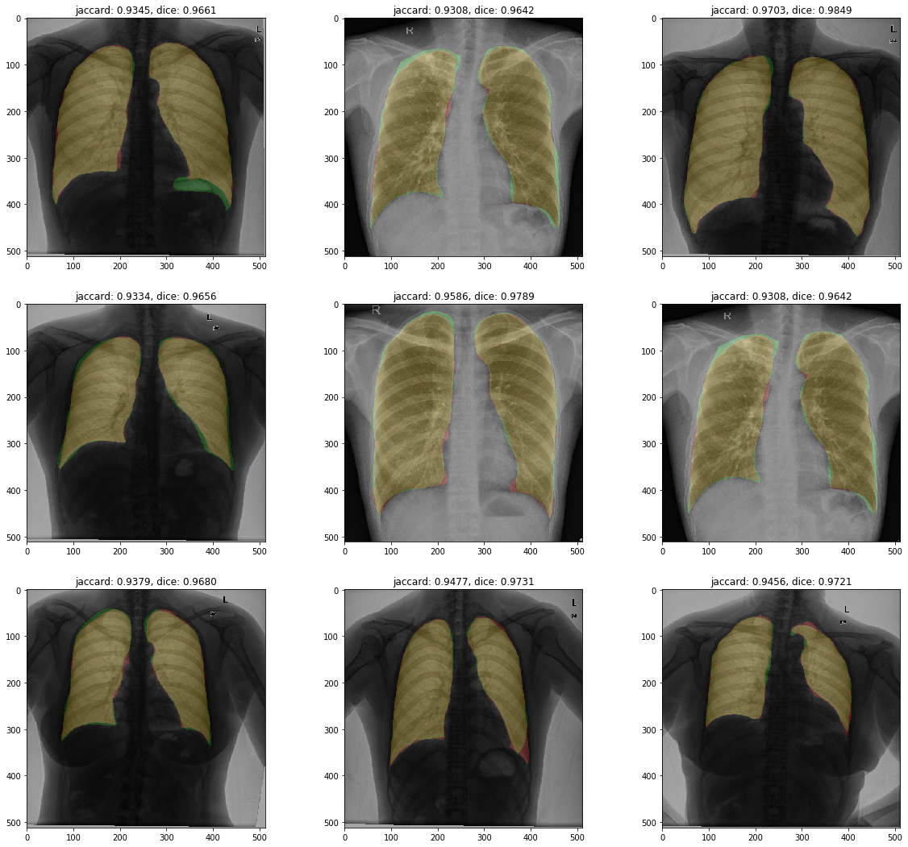

# Support Ukraine 🇺🇦
["how to" instruction](https://shard-cow-7b4.notion.site/HOW-YOU-CAN-SUPPORT-UKRAINE-0bef9f65892f45b79068ecc295b4e119)

# 🦉 Lung segmentation

## Data and task description


Dataset consists of collected from public available chest X-Ray (CXR) images.
Overall amount of images is 800 meanwhile labeled only 704 of them.
Whole dataset was randomly divided into train (0.8 of total) validation (0.1 splited from train) and test parts. Splits were saved into ```splits.pk```.

The main task is to implement pixel-wise segmentation on the available data to detect lung area.
Download link on the dataset https://drive.google.com/file/d/1ffbbyoPf-I3Y0iGbBahXpWqYdGd7xxQQ/view.

## Proposed solution
The most obvious solution for semantic segmentation problems is UNet - fully convolutional network with an encoder-decoder path. High-resolution features from the contracting path are combined with the upsampled output in order to predict more precise output based on this information, which is the main idea of this architecture.

Softmax function was applied to model output and negative log-likelihood loss was used to train network.
Optimization criterion - Adam with 0.0005 learning rate.

Some kinds of data augmentation were used: horizontal and vertical shift, minor zoom and padding.
All images and masks were resized to 512x512 size before passing the network.
To improve performance was decided to use pretrained on ImageNet encoder from vgg11 network.
This approach slightly improves performance and greatly accelerate network convergence.
Vanilla unet configuration doesn't have batch normalization. Nowadays it is used almost every time, so it was added to improve network convergence too.
Such network configuration outperforms other variations of unet without batch norm and pretrained weights on validation dataset so it was chosen for final evaluation

Networks were trained on a batch of 4 images during more than 50 epochs on average.

After 40 epoch network stops to improve validation score and network began to overfit.

Weights with best validation scores were saved into ```models/``` folder. 
Weights description:

- unet-2v: simple unet + augmentation

```
Best epoch
epoch: 30/200, time: 156.41338729858398, train loss: 0.047798131544717216, 
val loss: 0.06580803386474911, val jaccard: 0.9143155990985402, val dice: 0.9541912308910436
```

```
epochs: 159, overall time: 413.0m, mean epoch time: 156.15773498037325s
```

```
test loss: 0.0634, test jaccard: 0.9110, test dice: 0.9520
```

- unet-6v: pretrained vgg11 encoder + batch_norm + bilinear upscale + augmentation

```
Best epoch
epoch: 44/100, time: 135.7923891544342, train loss: 0.04682422929955094, 
val loss: 0.06021084505737873, val jaccard: 0.9213985225610566, val dice: 0.9580973742301004
```

```
epochs: 100, overall time: 227.0m, mean epoch time: 136.41898714780808s
```

```
test loss: 0.0530, test jaccard: 0.9268, test dice: 0.9611
```

Implementation of the described above solution using PyTorch you could find in ``scr/`` folder and `main.ipynb` notebook.


## Evaluation
For evaluation of model output was Jaccard and Dice metrics, well known for such kind of computer vision tasks.
Jaccard also is known as Intersection over Union, while Dice is the same with F1 measure. They are both showing almost the same things - overlap between ground truth and calculated mask. 

The main disadvantage is that they consider only the number of true positives, false positives and false negatives and ignore predicted location. So, more reasonable is to use average contour distance and average surface distance. These metrics are not implemented yet, more information about them you could find in "Accurate Lung Segmentation via Network-WiseTraining of Convolutional Networks" preprint, check out references list.

Evaluation was performed on test dataset, which was not used during training phase. 

There are the best-achived results: Jaccard score - **0.9268**, Dice score - **0.9611**.

Some you obtained results could see on the figure below.



## Next steps
There are some future steps on the way to improve the current solution:
- implement k-fold cross validation
- use transposed convolution instead of bilinear upscaling
- try more powerful encoder (i.e. resnet)

## References
- https://arxiv.org/pdf/1505.04597.pdf - U-Net: Convolutional Networks for Biomedical Image Segmentation
- https://arxiv.org/pdf/1811.12638.pdf - Towards Robust Lung Segmentation in Chest Radiographs with Deep Learning
- https://arxiv.org/pdf/1801.05746.pdf - TernausNet: U-Net with VGG11 Encoder Pre-Trained on ImageNet for Image Segmentation
- https://arxiv.org/pdf/1708.00710.pdf - Accurate Lung Segmentation via Network-WiseTraining of Convolutional Networks
